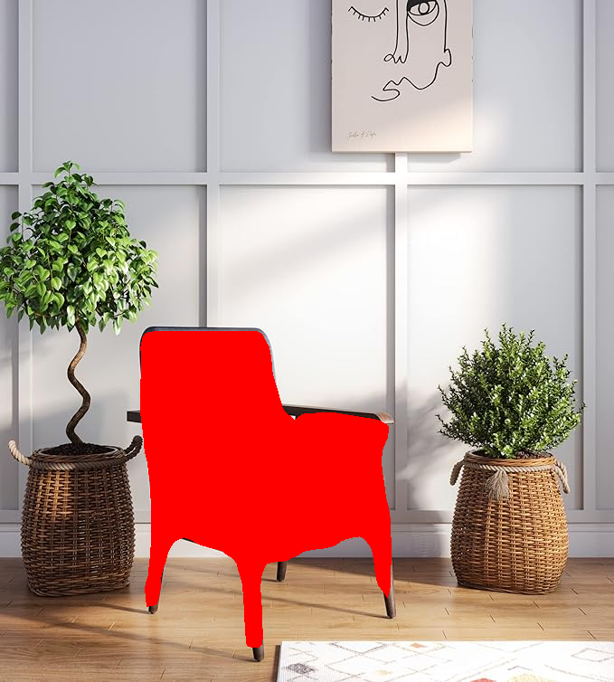

# Pose-Editing Assignment

## Problem Statement
This project aims to develop a solution for post-production editing of object poses in images using generative AI. The tasks include:

1. **Object Segmentation**: Segment the object specified by a user prompt within an image.
2. **Pose Editing**: Rotate the segmented object based on user-defined azimuth and polar angles, preserving the original background and scene realism.

## Tasks

### Task 1: Object Segmentation
- **Goal**: Identify and mask the object in an image based on a class prompt.
- **Input**: Image and class name.
- **Output**: Image with the segmented object highlighted with a red mask.


  
#### Example Command
```bash
python t1.py --image ./example.jpg --class "chair" --output ./segmented_output.png
```

## Task 2: Pose Editing
**Goal**: Change the pose of the segmented object by adjusting its azimuth and polar angles.
**Input**: Image, class name, and angle adjustments (azimuth and polar).
**Output**: Image with the object's pose edited according to the specified angles.


#### Example Command 
```bash
python t2.py --image ./example.jpg --class "chair" --azimuth +72 --polar +0 --output ./pose_edited_output.png
```

## How to Run

# Prerequisites
Install the required dependencies using the following command:

```bash
pip install -r requirements.txt
```

# Running the Code
# Object Segmentation (Task 1)

To run the object segmentation script:

```bash
python t1.py --image ./path_to_image.jpg --class "object_class_name" --output ./output_image.png
```
# Pose Editing (Task 2)

To run the pose editing script:

```bash
python t2.py --image ./path_to_image.jpg --class "object_class_name" --azimuth +degrees --polar +degrees --output ./output_image.png
```
## Approach

# Task 1: Object Segmentation
Utilized a pre-trained segmentation model, such as the Segment Anything Model (SAM), to identify and mask the object in the image based on the input class.
The segmented object is highlighted with a red mask to indicate successful identification.
# Task 2: Pose Editing
After segmenting the object, its pose is modified by rotating it according to the user-provided azimuth and polar angles.
The edited scene preserves the background and ensures that the object rotation looks natural.
Challenges & Solutions

# Challenge: Maintaining object boundaries during segmentation.
# Solution: Used fine-tuned pre-trained models and tested the model across different images to refine boundary detection.
# Challenge: Achieving smooth and realistic object rotation.
# Solution: Employed advanced 3D rotation techniques to adjust object poses while ensuring the background remains intact.

## Results

Sample results from both tasks can be found:

Segmented objects: Red mask over the identified object.
Pose-edited objects: Object rotated according to the user-specified angles while preserving the background.


# Future Work

Improved Boundary Detection: Further refine the segmentation model to handle more complex scenes with multiple objects.
Advanced Pose Editing: Incorporate more sophisticated 3D transformation techniques to enhance realism in object pose manipulation.
Failure Analysis: Conduct deeper analysis on failure cases and provide solutions to handle edge cases better.
